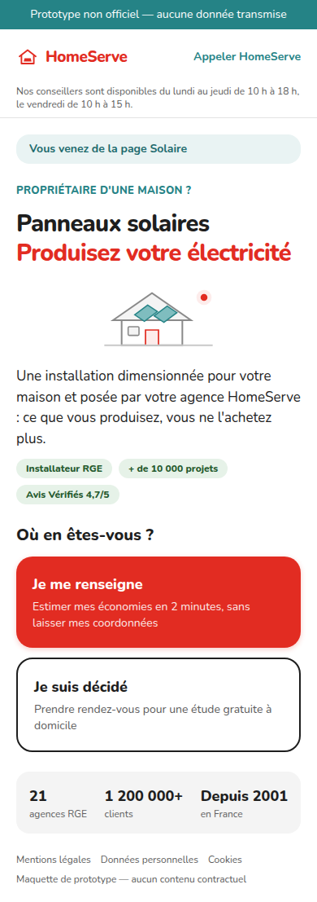
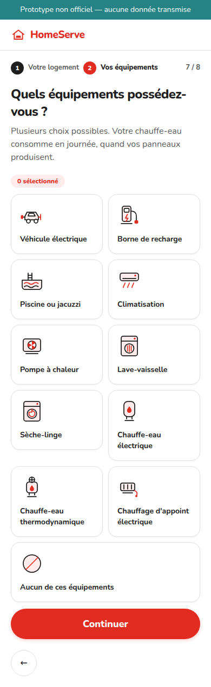
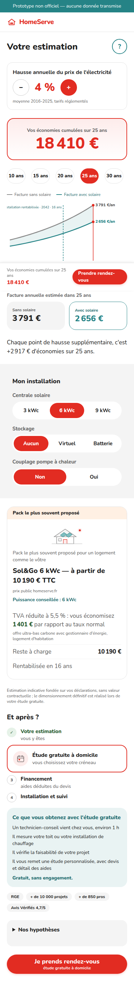
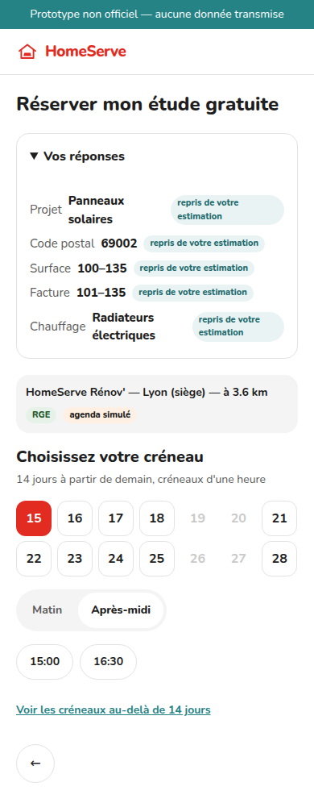

# Mon projet énergie — POC HomeServe

Prototype de business case produit par **Benoît Ploquin** (product owner) avec
Claude Code. **Non officiel, aucune donnée transmise.** Ni devis, ni étude, ni
engagement : des ordres de grandeur, datés et sourcés, pour démontrer un
parcours.



---

## 1. Ce que fait le produit

Un propriétaire de maison choisit son projet — solaire, pompe à chaleur, ou les
deux — et obtient **en 8 à 10 questions fermées une estimation chiffrée sans
donner ses coordonnées** : économies cumulées à l'horizon choisi, taux de hausse
de l'électricité réglable de 0 à 15 %, pack et prix public, aides 2026, reste à
charge. Il peut ensuite se qualifier et **réserver un créneau d'étude gratuite à
domicile** dans l'agence la plus proche.

**Trois portes d'entrée, un seul moteur :**

| Porte | Chemin | Ce qu'elle suppose |
|---|---|---|
| Tiède — « J'estime mes économies » | `/` → `/simulateur` → `/resultat` → `/rendez-vous` | rien ; le RDV hérite des réponses |
| Chaude — « Je réserve mon étude gratuite » | `/` → `/rendez-vous` | rien ; toutes les questions sont posées |
| Pressée — bouton d'appel | présent sur `/`, les sorties et la confirmation | instrumenté (`call_click`) |

Deux principes tiennent tout le parcours :

- **La non-répétition.** Ce que le simulateur a demandé n'est jamais redemandé
  au rendez-vous. Les nœuds pré-remplis sont sautés, leur règle d'éligibilité
  est quand même évaluée sur la valeur héritée, et le panneau « Vos réponses »
  les affiche avec un crayon pour les corriger.
- **Aucune impasse.** Chaque sortie oriente vers une offre HomeServe réelle,
  avec son URL : locataire, appartement, local professionnel, panneaux
  existants, toiture impossible, hors zone, non-rentabilité.

| Simulateur | Résultat | Calendrier |
|---|---|---|
|  |  |  |

---

## 2. Comment le lancer

```bash
corepack enable pnpm
pnpm install        # installe les dépendances et le hook de pre-commit
pnpm dev            # développement, http://localhost:3000
pnpm typecheck      # tsc --noEmit
pnpm test           # Vitest
pnpm build          # build de production (Turbopack)
pnpm start          # sert le build standalone
pnpm screenshots    # régénère docs/captures/ (nécessite un build)
```

**Drapeaux d'URL, utiles en démonstration :**

| Drapeau | Effet |
|---|---|
| `?projet=solaire\|pac\|les_deux` | pré-répond A0 sur l'accueil et affiche la ligne de contexte |
| `?variant=mur` | insère le mur de contact **avant** le résultat, qui n'est jamais affiché — le « avant » reproduit |
| `?debug=1` | panneau d'événements, avec bascule du drapeau de rentabilité |
| `?demo=1` | affiche la rentabilité (D41) et le choix de puissance (D45) |

**Codes postaux de démonstration :** `69002` (Lyon, agence à 3,6 km) ·
`99999` (agence de test surbookée, règle D30) · `75001` (hors zone, sortie S6).
**Téléphone de test :** `0600000001` (prospect déjà contacté, règle D29).
**Code SMS de démonstration :** `4821`.

⚠️ Le routage part de la **préfecture du département** dans un rayon de 60 km :
Nantes, Bordeaux, Rennes, Marseille et Strasbourg sortent en S6. Pour un
parcours nominal, préférez `69002`, `21000`, `31000`, `14000` ou `59000`.

---

## 3. Architecture

```
app/            routes App Router : / · (simulateur)/simulateur, resultat
                (rdv)/rendez-vous, sortie/[code], confirmation, gerer
components/     écrans 'use client' ; components/ui/ primitives Radix et pictogrammes
engine/         moteurs purs, sans React : solaire · pac · couplage · machine · agenda
lib/            store (sessionStorage) · analytics · content · contact · entrees · rdv
data/           hypotheses · tap-base · zones · agences · pac-baremes · arbre-rdv
content/        model.json (schéma type Prismic) · fr-fr.json (tout le wording)
test/           moteurs, écrans, données, en-têtes de sécurité
docs/           cadrage, design system, captures, journal de temps
```

**Trois règles de séparation :**

1. **La logique métier vit dans les données.** Un seuil, une cible d'arbre, un
   barème d'aide, un libellé : tout est dans `data/*.json` et
   `content/fr-fr.json`. Changer le seuil de surbooking ou le texte d'une
   sortie ne touche aucun `.ts`.
2. **Les moteurs sont purs et testés.** `engine/` n'importe pas React et ne
   fait aucune requête. C'est ce qui permet de les tester sans navigateur et de
   les réutiliser côté serveur si le produit passe en production.
3. **Le rendu est dynamique, et c'est un choix (D33).** Voir §5.

**Pourquoi cette forme d'état.** `lib/store.ts` expose l'état par
`useSyncExternalStore` avec `getServerSnapshot` = état vide, et n'hydrate
depuis `sessionStorage` qu'au premier abonnement — donc après le premier
rendu. Sans cela, le serveur et le client rendraient deux choses différentes.

---

## 4. Hypothèses et sources

Toutes les constantes sont **datées, sourcées, et marquées `extrapole: true`
quand ce sont des estimations de l'équipe**. Elles vivent dans `data/` et le
bloc « Nos hypothèses » du résultat les affiche à l'écran.

| Fichier | Contenu | Points saillants |
|---|---|---|
| `data/hypotheses.json` | prix de l'électricité, surplus, aides solaire, packs, stockage, table TAP, projection, contact | kWh 0,2001 € (TRVE 01/08/2026) · surplus 0,011 €/kWh · **prime à l'autoconsommation 0 €** depuis le 05/06/2026 |
| `data/tap-base.json` | taux d'autoproduction de base par zone × surface | calibré sur l'exemple EDF : base(Z3, 100–135) = 4,74 ; **le reste est extrapolé** |
| `data/zones.json` | 96 départements : zone climatique, zone d'ensoleillement, productible, préfecture | 2A, 2B et 75 non éligibles (règle du prototype) |
| `data/agences.json` | 21 agences réelles + 1 agence de test | distances calculées par Haversine, `competences` à confirmer |
| `data/pac-baremes.json` | SCOP, prix des énergies, rendements, prix PAC, MaPrimeRénov', CEE | SCOP réel 2,9 (ADEME) · MPR par profil · CEE par zone climatique |
| `data/arbre-rdv.json` | arbre de qualification complet, sorties et URLs réelles | 28 nœuds, 12 sorties |

**Non-régression obligatoire.** Le moteur solaire reproduit l'exemple EDF
vérifié — département 69, 100–135 m², 101–135 €/mois, radiateurs électriques,
véhicule électrique, chauffe-eau thermodynamique, occupation 5 j+ :
**facture 1 416 €/an, TAP 29,94 %, économies 424 €/an**. La convention de
projection EDF (N+1 incréments, cumul sur N+1 termes) est également reproduite
et testée sur un second relevé.

---

## 5. Sécurité

**Zéro secret par construction.** `.env.example` est vide, aucune variable
d'environnement n'est lue par le produit, et rien ne part sur le réseau au
runtime.

| Mesure | Mise en œuvre |
|---|---|
| CSP à nonce | `proxy.ts` génère un nonce par requête et le pose sur la requête — c'est là que Next.js le relit — et sur la réponse. `script-src` n'autorise **jamais** `'unsafe-inline'`. |
| En-têtes | HSTS 2 ans avec `preload`, `X-Frame-Options: DENY`, `nosniff`, `Referrer-Policy`, `Permissions-Policy` refusant caméra, micro, géolocalisation et paiement, COOP `same-origin` |
| Secrets | gitleaks en pre-commit (husky) **et** en CI ; le hook bloque le commit plutôt que de sauter la vérification quand le binaire manque |
| Données personnelles | état en `sessionStorage`, rendez-vous de démonstration en `localStorage`, rien d'autre |
| Requêtes externes | aucune au runtime : polices auto-hébergées par `next/font`, pictogrammes en SVG inline, aucune bibliothèque d'icônes |

**Conséquence assumée du nonce (D33).** Un nonce ne peut être apposé que
pendant un rendu dynamique : le pré-rendu statique a lieu au build, avant que
le nonce n'existe. Les pages sont donc rendues à la demande
(`force-dynamic`) — le réseau vers l'hébergeur est requis, il n'y a pas de
mode « fichier statique sur clé USB ». C'était le prix d'une CSP réellement
stricte.

---

## 6. Métriques et événements

`lib/analytics.ts` pousse chaque événement dans `window.dataLayer` **et** dans
un bus interne que `?debug=1` affiche. Aucune requête : le POC démontre
l'instrumentation, il ne la branche pas.

| Champ poussé | Piwik PRO | GTM |
|---|---|---|
| `event` | nom de l'événement personnalisé | `event` du dataLayer |
| `variant` | dimension personnalisée (test A/B) | variable de couche de données |
| `ts` | horodatage client | idem |
| autres clés | paramètres d'événement | variables de couche de données |

**Simulateur :** `sim_start` (porte `projet` et `source`), `sim_step_{n}`,
`sim_result_shown`, `sim_inflation_changed`, `sim_option_toggled`,
`sim_hypotheses_opened`, `sim_next_steps_viewed`, `sim_to_booking`.
**Rendez-vous :** `booking_start`, `booking_step_{n}`, `booking_exit_{code}`,
`booking_contact_submitted`, `booking_otp_ok`, `booking_slot_selected`,
`booking_engaged`, `booking_slot_confirmed`, `booking_ics_downloaded`.
**Transverses :** `callback_requested`, `call_click{source, step}`.

Ce qu'on cherche à mesurer : le taux de passage estimation → RDV, l'écart
entre la variante par défaut et `?variant=mur` (le tunnel actuel), et la part
des sorties d'orientation dans le total.

---

## 7. Ce qui est réel, ce qui est simulé, ce qui reste à faire

Le prototype **dit toujours à l'écran ce qui est simulé** (badges « mode démo »,
« agenda simulé », « règle simulée »). Le détail complet est dans
`docs/regles-rdv-et-donnees.md` §4 ; voici les règles post-réservation.

| Règle | POC | Simulé | Cible | Question au SI HomeServe |
|---|---|---|---|---|
| Routage d'agence | département → agence la plus proche ≤ 60 km (Haversine depuis la préfecture) | — | géocodage de l'adresse, temps de trajet réel | Quel référentiel d'adresses et quel calcul de zone de chalandise ? |
| Compétence produit | champ `competences` par agence | valeurs supposées | agence devant couvrir le produit demandé | Quelles filiales font solaire **et** PAC ? |
| Grille de créneaux | 14 jours, J+1 ouvré, départs toutes les 30 min, visites 60 min | générateur déterministe seedé par le code postal | disponibilités réelles des conseillers, moins trajets et congés | Quel logiciel de tournée, et expose-t-il une API ? |
| Capacité | — | capacité implicite du générateur | `max_rdv_jour` par conseiller, temps de trajet | Comment la capacité est-elle pilotée aujourd'hui ? |
| Surbooking (D30) | seuil de 4 créneaux libres sur 10 jours, `self_booking_actif` par agence | agence de test `99999` bridée pour la démonstration | calcul temps réel, proposition d'une agence voisine | Qui décide qu'une agence sort du dispositif ? |
| Dédoublonnage (D32) | téléphone normalisé et email comparés au `localStorage` | liste de prospects fictifs | Salesforce Duplicate Rules + service de matching | Quelle clé de rapprochement fait foi ? Quelle fenêtre de doublon ? |
| Lead ouvert au plateau (D29) | — | téléphone `0600000001` → « un conseiller vous a déjà contacté » | rattachement CRM et notification du plateau | Quel workflow plateau, et comment le notifier ? |
| OTP | 4 cases, code affiché | code `4821` | OTP SMS réel + anti-abus | Quel fournisseur SMS ? |
| Verrouillage du créneau | hors périmètre | — | verrou optimiste avec TTL pendant l'OTP | L'agenda cible sait-il verrouiller ? |
| Écriture du RDV | `localStorage` | — | `POST /rdv` → Salesforce (Lead + Event), SMS, email, ICS, rappel J-1 | Quel contrat d'API, quels consentements à porter ? |
| Client existant | sortie prévue dans l'arbre | — | orientation SAV / entretien / nouveau projet | Comment distingue-t-on client et prospect ? |

**Points de rebranchement** : `/api/rdv` (non implémenté) → `api.homeserve.fr`
→ Salesforce ; `content/fr-fr.json` → Prismic (le schéma `content/model.json`
suit le type `simulator_wording`) ; `lib/analytics.ts` → Piwik PRO ou GTM.

---

## 8. Docker et GKE

```bash
docker build -t homeserve-poc .
docker run --rm -p 3000:3000 homeserve-poc
```

Image multi-étapes `node:22-alpine`, sortie `standalone`, utilisateur non root,
healthcheck. Sur GKE : `Deployment` + `Service` + `Ingress`, readiness sur
`GET /`, application sans état (tout vit dans le navigateur), donc scalable
sans affinité de session.

> ⚠️ **Le Dockerfile a été relu, pas exécuté.** La passerelle réseau de
> l'environnement de développement refuse le CDN de Docker Hub : même
> `docker pull node:22-alpine` échoue. Le fichier est donc à valider par un
> `docker build` sur un réseau ouvert. À noter : `output: 'standalone'` est
> désactivé quand `VERCEL` est défini, l'empaquetage Vercel ne s'en accommodant
> pas.

---

## 9. Limites et prochaines étapes

**Limites assumées.**

- La table TAP n'est calibrée que sur **un** exemple EDF vérifié ; les autres
  cellules sont extrapolées (±1,5 pt par zone, ±1 pt par tranche de surface).
  À recalibrer sur des devis réels HomeServe.
- Les prix des packs sont les prix publics « à partir de » du site ; le
  dimensionnement réel relève de l'étude à domicile — l'écran ne dit jamais
  « votre installation ».
- Le moteur PAC est volontairement simplifié (SCOP unique, pas de calcul de
  déperditions) : c'est un ordre de grandeur, pas une étude thermique.
- `/gerer` est un écran non fonctionnel, et le dit.
- La paire orange du design system (`orange-100` / `orange-600`) plafonne à
  4,29:1 : sous AA pour du petit texte. Les badges gardent le fond orange mais
  passent en texte `neutre-700`. **Écart au design system à arbitrer.**

**Prochaines étapes, par ordre de valeur.**

1. Brancher `/api/rdv` sur un mock serveur, puis sur Salesforce.
2. Recalibrer la table TAP et les prix sur des données HomeServe réelles.
3. Remplacer le générateur de créneaux par l'agenda réel des agences.
4. OTP réel et anti-abus, puis verrouillage optimiste du créneau.
5. Passer le wording sous Prismic avec le type `simulator_wording`.
6. Mesurer : brancher Piwik PRO et faire tourner l'A/B `?variant=mur`.

---

## 10. Journal de temps

Le détail bloc par bloc est dans [`docs/journal-temps.md`](docs/journal-temps.md).

**Préparation déclarée la veille** (8 septembre) : cadrage produit, rétro-ingénierie
du simulateur EDF, construction des fichiers de données et des tests de moteurs,
maquettes Claude Design. Le dépôt en porte la trace : `docs/`, `data/`,
`content/` et `test/engine/` étaient écrits avant le premier bloc.

**Séance de build** : 7 blocs, chacun un prompt, un commit, un gate
`pnpm typecheck && pnpm test && pnpm build`. Les points d'arrêt du product
owner ont été tenus, et deux lots de correction ont suivi la recette.

---

## 11. Ce qui n'est pas dans la v1

C'est un choix, pas un oubli : Route Handler `/api/rdv`, Turnstile, Sentry,
API Base Adresse Nationale (le POC s'en tient au code postal), visio,
notifications réelles, back-office agence, et toute reprise du logo officiel
HomeServe — le mot-symbole et le pictogramme sont originaux.
