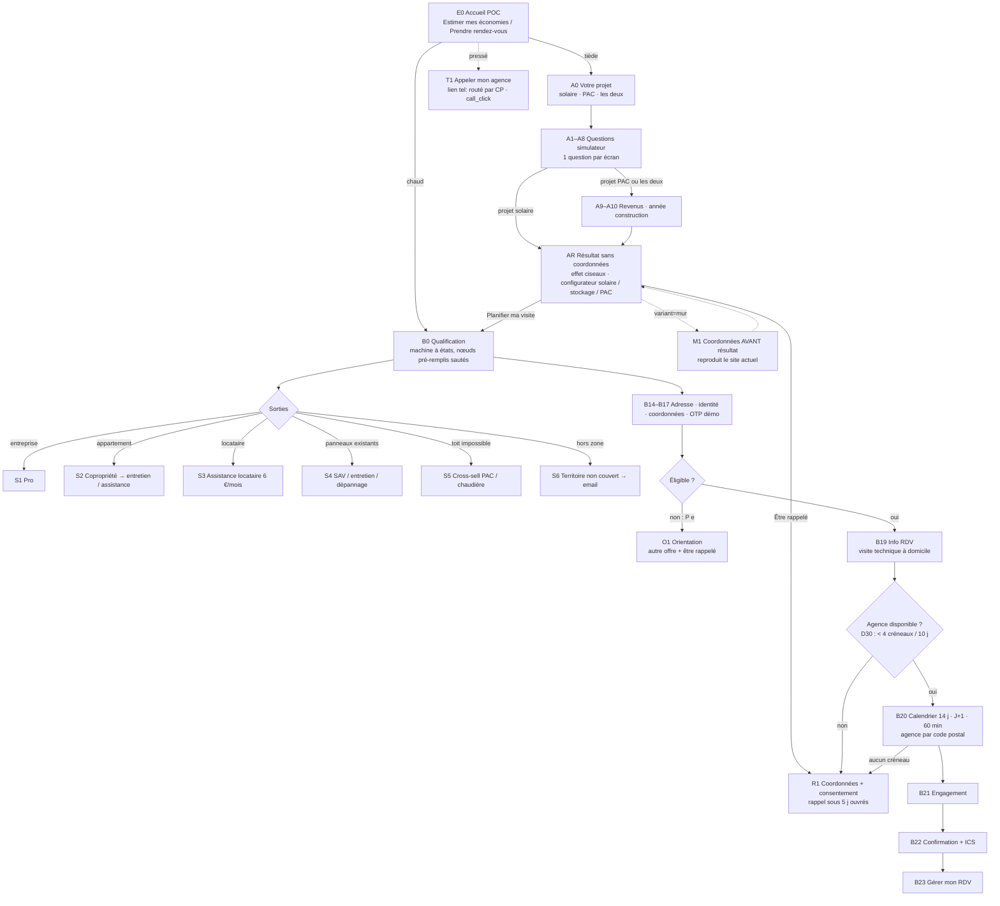

# Cartographie des parcours — v1.1 FIGÉE (08/09/2026)

Statut : **figée par Benoît le 08/09** (réponses aux 9 points, voir §7). Référence unique pour Claude Design (maquettes) et pour `data/arbre-rdv.json` (code). Toute modification passe par ici et par le journal de décisions.

**Règle de non-répétition** : un utilisateur venu du simulateur ne se voit **jamais** reposer une question déjà répondue. Les nœuds marqués « pré-rempli par A » sont sautés, leur règle d'éligibilité est évaluée silencieusement sur la valeur héritée, et le panneau « vos réponses » les affiche avec une icône crayon pour correction. Celui qui entre directement par « Prendre rendez-vous » répond à tout. Mécanisme (conception technique) : état partagé en sessionStorage, table de correspondance des clés §6, interpréteur qui avance tant que `prefill` est renseigné.

Principes actés : trois portes d'entrée (tiède → simulateur, chaud → RDV direct, pressé → appel tracké), un seul moteur de qualification (D14, D18) ; résultat du simulateur sans coordonnées ; question « box internet » supprimée (D13, décision 08/09) ; pas de visio ; aucune impasse, chaque sortie est une orientation ; sous-arbre toiture uniquement pour un projet solaire ; options (stockage, couplage) sur l'écran de résultat, pas en questions.

## 1. Vue d'ensemble

## 2. Porte tiède — Module A (simulateur)

| Id | Écran | Réponses | Règle | Alimente |
|---|---|---|---|---|
| A0 | Votre projet | solaire · pompe à chaleur · les deux | Détermine les branches A9–A10 et le gabarit de résultat | `projet` |
| A1 | Code postal | 5 chiffres | Dept → zone d'ensoleillement (Z1–Z5), zone climatique (H1–H3), agence la plus proche. CP 20 / 75 / 96–99 : **on calcule quand même**, bandeau « nous n'intervenons pas encore dans votre département », CTA RDV remplacé par « être informé » | `cp`, `dept` |
| A2 | Présence au logement (« entre 10h et 16h ») | moins de 3 jours · 3 à 4 jours · 5 jours et + par semaine | Malus −8,7 hors « 5 j+ » (coefficient distinct pour « 3–4 j » si trouvé dans le code) — *écran EDF réel : 3 tranches* | `occupation` |
| A3 | Personnes au foyer | 1 ou 2 · 3 ou 4 · 5 et + | Tranche facture par défaut | `personnes` |
| A4 | Surface au sol (**curseur à crans**) | < 70 · 70–99 · 100–135 · 136–175 · > 175 m² | segT ; < 70 m² → P(e) en B (seuil HomeServe D5). *Écran EDF : < 20 / 20–99 / 100–135 / 136–175 / > 175 ; mapping segT du code à vérifier* | `surface_sol` |
| A5 | Chauffage actuel | radiateurs électriques · pompe à chaleur · gaz, fioul ou bois · autre | Bonus/malus solaire ; énergie substituée pour la PAC (gaz / fioul distingués sur la branche PAC par une sous-question A5b) | `chauffage` |
| A6 | Équipements énergivores (multi, même écran que A5 chez EDF) | véhicule électrique · borne de recharge · piscine ou jacuzzi · climatisation · pompe à chaleur · lave-vaisselle · sèche-linge · chauffe-eau · aucun | Bonus/malus ; coefficients piscine, lave-vaisselle, sèche-linge, borne à extraire du code ou documentés « extrapolés » — *écran EDF réel : 8 équipements* | `equipements` |
| A7 | Chauffe-eau | thermodynamique · gaz de + de 10 ans · électrique de − de 10 ans · électrique de + de 10 ans · je ne sais pas | +16,3 / 0 / +19,6 / +19,6 / 0 (effet de l'âge à vérifier dans le code) — *écran EDF réel : 5 options* | `chauffe_eau` |
| A8 | Facture d'électricité mensuelle (**curseur à crans**) | < 60 · 60–100 · 101–135 · 136–175 · > 175 € | segF → facture annuelle {720, 1 080, 1 416, 1 860, 2 280} ; < 60 € → P(e) en B. *Écran EDF : 6 crans (< 20 / 20–80 / 81–100 / 101–135 / 136–175 / > 175)* | `facture_mensuelle` |
| A9 | *(PAC, les deux)* Revenu fiscal du foyer | 4 tranches libellées « environ », avec nombre de personnes rappelé et mention IdF / hors IdF | Profil MaPrimeRénov' bleu / jaune / violet / rose | `revenus` |
| A10 | *(PAC, les deux)* Année de construction | avant 1997 · 1997–2010 · après 2010 · en construction | > 15 ans pour MPR ; réutilisé par B9 ; « en construction » → P(e) | `annee_construction` |
| AR | Résultat | — | Voir §3 | `resultats` |

Tranches de facture : la tranche EDF « < 80 » est remplacée par « < 60 » et « 60–100 » pour porter le seuil HomeServe sans question supplémentaire.

## 3. Écran de résultat (AR) — contenu par projet

| Bloc | Solaire | PAC | Les deux |
|---|---|---|---|
| Chiffre principal | Économies estimées €/an | Économies estimées €/an sur le chauffage | Économies cumulées €/an |
| Recommandation | Pack conseillé 3 / 6 / 9 kWc, prix « à partir de » | Fourchette de prix PAC air/eau selon surface | Pack + PAC |
| Aides | Prime autoconso 80 €/kWc (si ≤ 9 kWc), TVA 5,5 % si HEMS | MaPrimeRénov' selon profil + CEE selon zone, « aucune avance de frais » | Les deux |
| Reste à charge et retour | Reste à charge, années avant rentabilité | Idem | Idem |
| **Effet ciseaux (cœur de l'écran, calé sur l'écran EDF réel)** | Bloc « Hausse annuelle du prix de l'électricité » : contrôle − / valeur / + **de 0 à 15 %, défaut 4 %** (source affichée : TRVE 2016-2025), **recalcul en direct** (EDF impose un bouton « Valider » : on l'écarte). Chips d'horizon **10 · 15 · 20 · 25 · 30 ans**. **Tuile héros = économies cumulées à l'horizon choisi**. Deux tuiles « facture annuelle estimée dans N ans » sans / avec solaire (EDF dit « facture moyenne annuelle », libellé écarté). **Sous les tuiles, la courbe** que la zone capturée d'EDF ne montre pas : facture sans solaire (neutre-400) vs avec solaire (canard-500) sur l'horizon, aire entre les deux = cumul. Phrase dynamique : « chaque point de hausse supplémentaire = +X € d'économies sur N ans ». Bouton « Comprendre mon résultat (?) » ouvrant un onboarding en 3–4 volets comme EDF. | Même bloc sur 15 ans : dépense de chauffage actuelle (gaz/fioul, taux de hausse propre) vs coût de la PAC | 30 ans, économies cumulées des deux |
| **Configurateur « Mon installation »** (options, à résoudre en UX au design) | Un seul bloc réunissant : centrale solaire (kWc conseillé, ajustable 3/6/9) · stockage (aucun · virtuel 15 €/mois · batterie physique sur devis) · couplage PAC (oui/non). Chaque changement recalcule le cumul et la courbe en direct. | Fourchette de prix PAC ; couplage solaire (oui/non) | Les trois leviers réunis ; décision 08/09 : concilier batterie, PAC et centrale solaire dans une même UX |
| Hypothèses | Bloc déplié : constantes datées et sourcées | Idem | Idem |
| CTA principal | **Planifier ma visite technique gratuite** → B0 pré-rempli | Idem | Idem |
| CTA secondaires | Être rappelé (→ R1) · Appeler mon agence (T1). *« Recevoir mon étude » supprimé (08/09) : le résultat est fourni en direct.* | Idem | Idem |
| Widget sticky | Au défilement du résultat, bandeau collant « Planifier ma visite » (pattern Ensol/EDF « Je demande un bilan personnalisé ») | Idem | Idem |
| Hors zone | Bandeau + « Être informé de l'ouverture » (→ S6) | Idem | Idem |

Variante `?variant=mur` : l'écran M1 (nom, prénom, email, téléphone, texte « un expert HomeServe Rénov' vous contactera sous 48 heures ouvrées afin de vous présenter les résultats de votre simulation ») s'insère avant AR et reproduit **mot pour mot le mur du simulateur solaire HomeServe actuel** (capture H12). En variante mur, AR n'est pas affiché : écran « Merci, un expert vous rappelle » — c'est le « avant » réel. Sert uniquement à la démonstration A/B ; preuve terrain : A/B test EDF 2S gagné par « résultat puis RDV ».

**T1 — Appeler mon agence (porte « analogique pressé »)** : présent sur E0, AR, et dans l'en-tête de B (comme le numéro omniprésent du simulateur HomeServe actuel, dont l'instrumentation n'est pas prouvée : aucun call tracking détecté dans le HTML ni la politique cookies, à vérifier en Chrome), **instrumenté** : lien `tel:` de l'agence routée par le code postal (ou numéro national si CP inconnu), événement `call_click{source, step}`. En v2 : call tracking réel (numéros dynamiques). Le POC montre ainsi que le téléphone n'est pas supprimé mais mesuré.

## 4. Porte chaude et qualification — Module B (machine à états)

Ordre EDF conservé : disqualifier tôt, engager tard. Colonne « pré-rempli par A » : le nœud est sauté si la valeur existe, mais sa règle P(e) est quand même évaluée.

| Id | Question | Réponses → cible | P(e) / sortie | Pré-rempli par A |
|---|---|---|---|---|
| B0 | Votre logement | maison → B1 · appartement → **S2** · local professionnel → **S1** | Sorties immédiates | — |
| B1 | Vous êtes | propriétaire → B2 · locataire → **S3** | Sortie | — |
| B2 | Panneaux solaires déjà installés ? | non → B3 · oui → B2a | — | `projet` = PAC ⇒ question posée quand même (le solaire existant change le couplage) |
| B2a | Installés par HomeServe ? | oui → B2b · non → **S4c** (dépannage à la carte) | Sortie | — |
| B2b | Votre besoin | dépannage → **S4a** · entretien → **S4b** · autre projet → B3 | Sorties | — |
| B3 | Votre projet | solaire · PAC · les deux → B5 | Détermine le sous-arbre B10 | `projet` |
| ~~B4~~ | *Horizon — supprimé (décision 08/09 : le résultat est fourni en direct, pas de nurturing par email)* | — | — | — |
| B5 | Facture mensuelle | tranches A8 | < 60 € → **P(e) facture_faible** | `facture_mensuelle` |
| B6 | Résidence | principale → B7 · secondaire → B7 | secondaire → **P(e) residence_secondaire** | — |
| B7 | Surface au sol | tranches A4 | < 70 m² → **P(e) surface_faible** (solaire uniquement) → B9 | `surface_sol` |
| ~~B8~~ | *Connexion internet — supprimée (décision 08/09 : le matériel HomeServe n'en dépend pas, D13 ; la note technicien se fera en visite)* | — | — | — |
| B9 | Année de construction | tranches A10 | en construction → **P(e) en_construction** | `annee_construction` |
| B10 | *(solaire)* État de la toiture | rénovée → B12 · d'origine → B11 · je ne sais pas → B11 ; si avant 1997 → B11 quel que soit l'état | — | — |
| B11 | *(solaire)* Amiante | non → B12 · oui → B13 · je ne sais pas → B12 (note technicien) | — | — |
| B12 | *(solaire)* Revêtement | tuile · ardoise · bac acier → B14 · autres matériaux → B13 | — | — |
| B13 | *(solaire)* Alternative au toit | toit-terrasse · jardin → B14 · aucune → **S5** (cross-sell PAC si pas déjà projet PAC ; sinon orientation isolation) | Sortie | — |
| B10' | *(PAC)* Émetteurs de chauffage | radiateurs à eau · plancher chauffant → B11' · radiateurs électriques → B11' (note : PAC air/air ou réseau à créer, affiché en éligibilité) | — | `chauffage` = électrique ⇒ pré-rempli « radiateurs électriques » |
| B11' | *(PAC)* Espace extérieur pour l'unité | oui · je ne sais pas → B14 · non → B14 (note technicien) | — | — |
| B14 | Adresse, code postal, ville | saisie libre (CP pré-rempli) | CP 20 / 75 / 96–99 ou agence > 50 km → **S6** | `cp` |
| B15 | Prénom, nom | saisie | — | — |
| B16 | Email, téléphone | saisie ; case « je ne souhaite pas être appelé » | — | — |
| B17 | Code SMS | **mode démo** : code affiché | — | — |
| B18 | Éligibilité | si `nonEligible` non vide → **O1** ; sinon → B19 | — | — |
| B19 | Votre rendez-vous | Écran d'information, pas de choix : « visite technique à domicile, ~1h, en présence d'un propriétaire » (décision 08/09 : pas de visio, aucune pratique chez HomeServe) → B20 | — | — |
| B17b | Prospect existant (**mock**, D32) | après OTP : même téléphone/email qu'un RDV déjà pris → écran « Vous avez déjà un rendez-vous » + gérer ; numéro de test `0600000001` → écran « Un conseiller vous a déjà contacté ; votre créneau reste réservable » (D29, plateau notifié) | — | — |
| B19b | Disponibilité (**mock**, D30) | si l'agence a < 4 créneaux libres sur 10 jours (CP de test) → écran « Forte demande dans votre secteur » + **R1** ; self-booking masqué | — | — |
| B20 | Calendrier | **14 jours glissants, premier créneau J+1 ouvré, visites de 60 min** (D31), matin / après-midi, agence affichée ; « aucun créneau ne me convient » → **R1** | — | — |
| B21 | Engagement | modale « ce rendez-vous mobilise un technicien ~1h ; modification par email / SMS » | — | — |
| B22 | Confirmation | récap, documents à préparer (factures, taxe foncière, photo compteur / toit), « ajouter à mon agenda » (ICS réel), déroulé du RDV | — | — |
| B23 | Gérer mon RDV | un écran : modifier / annuler (non fonctionnel, badge démo) ; doublon détecté via localStorage | — | — |

## 5. Sorties et orientations (jamais d'impasse)

| Code | Déclencheur | Message | Offre HomeServe et URL | Commandable en ligne ? | CTA secondaire |
|---|---|---|---|---|---|
| S1 | local professionnel | « Nous accompagnons les particuliers ; pour un projet professionnel… » | Formulaire partenaire (groupe.homeserve.fr/partenaire-commercial) | Non | Capture email |
| S2 | appartement | « En copropriété, le solaire individuel n'est pas possible ; voici ce que nous pouvons faire » | Entretien chaudière (/entretien/chaudiere), assistance Dépannez-moi | Téléphone | Transmettre le simulateur à un proche propriétaire |
| S3 | locataire | « Protégez votre logement sans travaux » | Dépannez-moi Plomberie Locataire 6 €/mois (assistance.homeserve.fr/assistance/plomberie/) | Téléphone (0 808 809 013) | Transmettre à mon propriétaire |
| S4a / S4b | panneaux HomeServe, dépannage / entretien | « Nous prenons le relais » | /depannage-entretien | Formulaire → rappel | — |
| S4c | panneaux d'un autre installateur | « Diagnostic et dépannage à la carte » | /diagnostic/oe (devis en ligne, CB débitée à J+7) | **Oui** | — |
| S5 | toit impossible, aucune alternative | « Votre toit ne permet pas le solaire ; votre facture peut baisser autrement » | PAC (/chauffage-climatisation/pompes-a-chaleur) ou isolation | Simulateur → devis | Relancer le simulateur en mode PAC (état conservé) |
| S6 | hors zone d'intervention | « Nous n'intervenons pas encore chez vous » | — | — | « Être informé de l'ouverture » (email) |
| O1 | P(e) : facture faible, résidence secondaire, petit toit, en construction | « D'après vos réponses, une visite solaire ne serait pas rentable pour vous aujourd'hui ; voici nos alternatives » avec la règle déclenchée expliquée | Selon la règle : PAC, entretien, assistance, « me recontacter quand le logement sera livré » | Variable | Être rappelé (consentement) |
| R1 | choix « être rappelé » ou aucun créneau | « Un conseiller de l'agence X vous rappelle sous 5 jours ouvrés, à votre demande » | Coordonnées + consentement horodaté (loi du 11/08/2026) | — | Créneau préféré (matin / après-midi) |

## 6. Table de pré-remplissage A → B

| Clé d'état | Posée en A | Réutilisée en B | Effet |
|---|---|---|---|
| `projet` | A0 | B3 | B3 sautée |
| `cp`, `dept` | A1 | B14 (pré-rempli, modifiable), routage agence, guard hors zone | — |
| `surface_sol` | A4 | B7 | B7 sautée, P(e) évaluée |
| `facture_mensuelle` | A8 | B5 | B5 sautée, P(e) évaluée |
| `chauffage` | A5 | B10' | « électrique » pré-remplit les émetteurs |
| `annee_construction` | A10 (PAC, les deux) | B9 | B9 sautée si renseignée, P(e) évaluée |
| `revenus` | A9 | — | Note pour le technicien (profil MPR) |

Porte chaude (B0 direct) : aucune clé, 16 à 18 questions selon le projet, comme le parcours EDF.

## 7. Décisions tranchées par Benoît (08/09)

| # | Point | Décision | Effet |
|---|---|---|---|
| 1 | Trois portes (tiède / chaud / pressé), un moteur | Validé (D14, D18) | E0 avec deux CTA + bouton d'appel |
| 2 | B0 « Votre logement » (maison / appartement / local pro) en premier | **Oui** | Persona Nadia traité dès la première question |
| 3 | Seuils facture < 60 €/mois, surface < 70 m², tranche « < 70 · 70–99 » | **OK** | `arbre-rdv.json`, curseurs A4/A8 |
| 4 | B8 connexion internet | **Supprimée** | Aucune question réseau ; option batterie toujours proposée |
| 5 | Sous-arbre PAC (émetteurs, espace extérieur) | **Suffisant pour le POC** ; à consigner dans les pistes de refinement (expertise chauffagiste à solliciter) | B10', B11' conservés tels quels |
| 6 | B4 horizon / CTA « recevoir mon étude » | **Supprimés** : le résultat est fourni en direct | Pas de nurturing email en v1 |
| 7 | Visio | **Retirée** (aucune pratique chez HomeServe) | B19 devient un écran d'information « visite technique à domicile » |
| 8 | Options sur l'écran de résultat | **Oui**, à résoudre en UX au design : concilier batterie, PAC et centrale solaire dans un configurateur unique | Brief Claude Design |
| 9 | Effet ciseaux (taux 0–15 %, cumul héros, courbe) | **Oui**, contribue à l'effet « wahou » | Cœur de l'écran AR |

Pistes de refinement consignées (hors v1) : arbre PAC à valider avec un chauffagiste (émetteurs, puissance, contraintes acoustiques, plancher chauffant) ; nurturing email si la donnée montre un fort taux « pas décidé » ; visio si HomeServe l'introduit.

## 7 bis. Références « avant » désormais capturées
- **Simulateur solaire HomeServe actuel** (planche `HOMESERVE_simulateur_solaire_captures.html`, addendum 2 de l'audit) : Ma maison (chauffage, équipements, facture libre, usage) → Mon projet solaire (puissance connue ?) → Mon toit (adresse, étages, inclinaison, couverture, astuce, **tracé du pan sur satellite**) → mur de contact → rappel 48 h ouvrées, **aucun résultat**. Le POC reprend ses questions « maison » (mêmes 4 modes de chauffage, mêmes équipements), remplace le tracé du toit par la tranche de surface (modèle EDF), et révèle le résultat.
- **Simulateur EDF** (planche `EDF_simulateur_captures.html`) : modèle du résultat (cumul à horizon, taux 0–15 %, toggle batterie).

## 8. Captures disponibles et restantes
Session 2 du brief Chrome **réalisée le 08/09** (16 écrans mobiles, planche `EDF_simulateur_captures.html`, relevé `12-releve-simulateur-edf-ecrans.md`). Elle a corrigé A2, A4, A6, A7, A8 et l'écran de résultat ci-dessus. Reste à observer chez EDF : la section « Évolution de votre facture » sous les tuiles (graphique ?), la destination du CTA « Je demande un bilan personnalisé », la version desktop, et l'exemple de référence (dept 69, 100–135 m², 101–135 €) pour caler la table TAP. Otovo et Hello Watt (sessions 3–4) pour la présentation du prix et du retour sur investissement.

Point 9 (§7) : l'écran EDF réel utilise déjà le cumul comme chiffre héros et des bornes 0–15 % : la proposition devient « reprendre EDF et ajouter la courbe + le recalcul en direct ».

Une fois ces huit points tranchés, la cartographie est figée et sert de brief à Claude Design.
