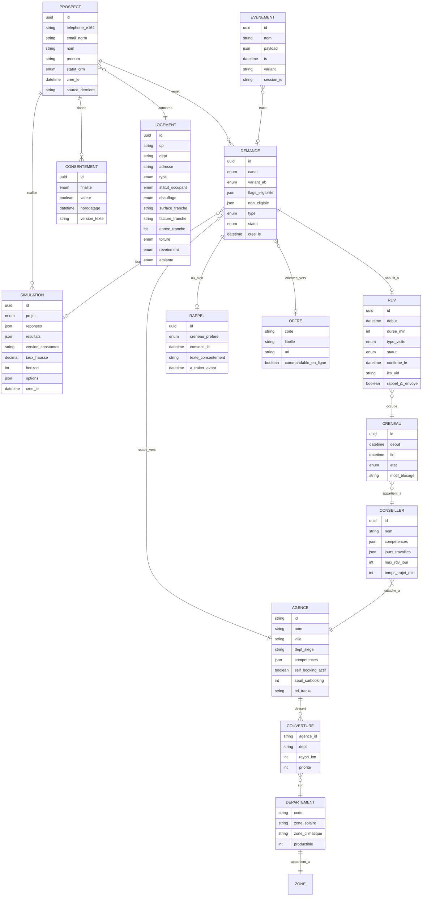

# Modèle de données, stockage et règles de la prise de rendez-vous (v1 — arbitré par le PO le 08/09/2026)

**Statut** : règles fonctionnelles tranchées par le product owner (D29–D32) ; les éléments encore marqués « ⚑ » restent des propositions à confirmer ou relèvent de la cible.

**Principe directeur (PO, 08/09) : s'arrêter au bon moment.** Nous ne connaissons ni le logiciel de tournée de HomeServe Energies Services, ni l'architecture et le workflow du plateau, ni le détail du CRM (Salesforce est une inférence DNS). Le POC ne spécule pas sur ces intégrations : il **montre que chaque situation métier a une sortie prévue** (écran, règle, événement) et documente la question à poser au SI HomeServe. La séquence §4.1 est donc un schéma d'intention, pas une spécification d'intégration. La spécification technique détaillée viendra après, en tenant compte des contraintes HomeServe connues et de celles qui restent à découvrir.

## 0. Décisions du product owner (08/09)
| # | Sujet | Décision |
|---|---|---|
| D29 | Prospect avec lead ouvert au plateau | **Laisser réserver et notifier le plateau** ; la tâche plateau se ferme automatiquement (logique EDF ENR : bascule plateau → digital). Démontré en POC par un numéro de test. |
| D30 | Agence chargée | **Masquer le self-booking si moins de 4 créneaux libres sur les 10 prochains jours** ; repli « forte demande dans votre secteur » + « être rappelé ». Seuil et fenêtre paramétrables par agence. Démontré en POC par un code postal de test. |
| D31 | Paramètres d'agenda | **Horizon 14 jours · délai minimum J+1 · visite 60 min** (plus réactif que les valeurs EDF 21 j / J+2 / 90 min). |
| D32 | Scénarios démontrés | RDV déjà pris (doublon), lead déjà au plateau, agence surbookée : **simulés par des valeurs de test**. Client existant : **documenté seulement** (sortie prévue, pas d'écran). Tout ce qui touche au logiciel de tournée, au CRM et au workflow plateau : identifié, non simulé. |

Complète `08-architecture-poc-v3-nextjs.md` (front) et `09-cartographie-parcours.md` (écrans). Statut de chaque brique : **POC** = réellement implémenté · **MOCK** = simulé et signalé à l'écran · **CIBLE** = identifié, spécifié ici, hors POC.

## 1. Où se fait le calcul du simulateur

| | POC | Cible |
|---|---|---|
| Lieu | 100 % navigateur : `engine/solaire.ts`, `engine/pac.ts`, `engine/couplage.ts`, fonctions pures | Identique côté client pour l'instantanéité, **plus** recalcul côté serveur à la soumission du RDV (source de vérité pour le CRM, protection contre la manipulation du front) |
| Données d'entrée | Réponses fermées (tranches), code postal | Idem + pré-remplissage DPE/BDNB (comme le bilan global HomeServe), productible PVGIS live par adresse |
| Constantes | `data/*.json` datés et sourcés, embarqués au build | Table de référence versionnée côté serveur (ou Prismic), avec date d'effet ; le front charge la version courante ; chaque simulation stocke la **version des constantes** utilisée |
| Sortie | `SolaireResult`, `PacResult`, `CouplageResult` en sessionStorage | Objet `Simulation` persisté (voir ERD) rattaché au prospect à la prise de RDV, jamais avant (pas de coordonnées) |
| Traçabilité | Bloc « nos hypothèses » à l'écran | Idem + `simulation_id` transmis au conseiller avec les hypothèses figées |

Pourquoi le client : zéro latence, zéro secret, démo hors ligne. Pourquoi un recalcul serveur en cible : le chiffre présenté au conseiller doit être reproductible et non altérable.

## 2. Modèle de données (ERD cible, sous-ensemble POC en gras)



**POC** : `LOGEMENT`, `SIMULATION`, `DEMANDE`, `RDV`, `CRENEAU` (générés), `AGENCE`, `COUVERTURE`, `DEPARTEMENT`, `OFFRE`, `CONSENTEMENT`, `EVENEMENT` existent comme types TypeScript et JSON ; `PROSPECT` et `CONSEILLER` sont réduits au minimum (coordonnées en sessionStorage, conseillers implicites derrière les créneaux). Aucune persistance serveur.

## 3. Stockage par étape

| Donnée | POC | v2 (2 semaines) | Cible HomeServe |
|---|---|---|---|
| Réponses et résultats du simulateur | sessionStorage (effacé à la fermeture de l'onglet) | Idem | Idem ; persisté en base seulement à la prise de RDV ou de rappel, avec `simulation_id` |
| État de la qualification | sessionStorage | Idem | Idem |
| Coordonnées | sessionStorage, jamais transmises (bandeau) | Supabase `demandes` (RLS insert-only, clé anon bornée) | `POST api.homeserve.fr/leads` → Salesforce Lead/Contact ; chiffrement en transit, rétention selon politique HomeServe |
| RDV | localStorage `hs.rdv` (démo doublon, écran « gérer ») | Supabase `rdv` + page `/admin` de démo | Salesforce Event / outil de planification des agences ; ICS régénéré côté serveur |
| Créneaux | Générés côté client, déterministes (seed = CP) | Table `creneaux` par agence, alimentée à la main | Lecture de l'agenda réel des conseillers (API planification) |
| Consentements | Dans l'état, horodatés, affichés en confirmation | Table `consentements` | Salesforce + registre CNIL, preuve conservée |
| Événements analytics | `window.dataLayer` + panneau `?debug=1` | Idem | Piwik PRO Tag Manager / GTM → Piwik PRO, conversions offline renvoyées aux régies (Enhanced Conversions / CAPI) |
| Constantes de calcul | JSON embarqués | Idem | Référentiel versionné (Prismic ou table), date d'effet |

## 4. Chaîne post-réservation et règles

### 4.1 Séquence cible (ce qui se passe quand l'utilisateur confirme)

```mermaid
sequenceDiagram
  participant U as Utilisateur
  participant F as Front
  participant API as api.homeserve.fr
  participant CRM as Salesforce
  participant AG as Agenda agence
  participant N as Notifications
  U->>F: Confirme le créneau (après OTP + engagement)
  F->>API: POST /rdv {demande, simulation_id, creneau_id, consentements}
  API->>CRM: Recherche doublon (tel E.164, email, nom+CP)
  CRM-->>API: statut prospect (inconnu / ouvert plateau / RDV à venir / client / perdu)
  alt prospect inconnu ou perdu > 90 j
    API->>AG: Verrouille le créneau (optimiste, TTL 5 min) puis confirme
    API->>CRM: Crée Lead + Event, source=self_booking, variant, agence
    API->>N: SMS + email de confirmation, ICS, rappel J-1 programmé
    API-->>F: 201 {rdv_id, ics}
  else RDV déjà à venir
    API-->>F: 409 {rdv_existant} → écran « Vous avez déjà un rendez-vous » + gérer
  else lead ouvert au plateau (en cours d'appel)
    API->>CRM: Rattache la demande, notifie le conseiller
    API-->>F: 200 {mode: "plateau"} → écran « Un conseiller vous contacte déjà ; confirmer ce créneau ? » (règle §4.3)
  else client existant
    API-->>F: 200 {mode: "client"} → orientation SAV / entretien / nouveau projet
  end
  API->>F: événements offline (rdv_confirmed) → régies
```

### 4.2 Dédoublonnage et prospects existants

| Règle | Détail | POC | Cible |
|---|---|---|---|
| Clé de rapprochement | Téléphone normalisé E.164 (priorité), puis email en minuscules, puis nom + prénom + CP (score) | MOCK : téléphone/email vs `localStorage` et vs une liste de « prospects connus » fictifs | Salesforce Duplicate Rules + service de matching (la « lead factory » d'EDF ENR : dédoublonnage, vérification des numéros, scoring) |
| Fenêtre de doublon ⚑ (cible) | Proposition à confronter au CRM HomeServe : demande identique < 30 jours = même demande ; > 90 jours et statut perdu = nouveau cycle | MOCK | CIBLE |
| RDV à venir existant | Bloquer une seconde réservation ; proposer « gérer mon RDV » | **POC** (localStorage) | CIBLE (CRM) |
| Lead ouvert au plateau | Statuts : nouveau, tentative d'appel, en cours, RDV pris, perdu, client. Si « tentative d'appel » ou « en cours » : **D29 — laisser réserver et notifier le plateau**, fermeture automatique de la tâche plateau. Le mécanisme de notification dépend du workflow plateau HomeServe (inconnu) : identifié, non spécifié | MOCK : numéro fictif `0600000001` déclenche l'écran « un conseiller vous contacte déjà, confirmer ce créneau ? » | CIBLE |
| Client existant | Pas de nouveau lead ; orientation SAV / entretien / nouveau projet | **Documenté seulement (D32)** : sortie prévue dans l'arbre, pas d'écran de démo | CIBLE |
| Faux leads | OTP SMS obligatoire avant créneau ; numéro invalide = pas de RDV | MOCK (code affiché) | CIBLE (OTP réel + Turnstile) |

### 4.3 Disponibilité de la force commerciale et affichage des créneaux

| Règle | Détail | POC | Cible |
|---|---|---|---|
| Routage agence | Département → agences couvrantes (`couverture`), distance au CP, priorité ; si aucune ≤ 50 km → S6 « zone en cours d'ouverture » | **POC** (`agences.json` 21 sites + rayon 50 km) | CIBLE (géocodage adresse, temps de trajet) |
| Compétence produit ⚑ | Hypothèse : toutes les filiales HES ne font pas solaire **et** PAC ; l'agence doit couvrir le produit demandé, sinon agence suivante ou rappel | **POC** (champ `competences` par agence, valeurs à confirmer) | CIBLE |
| Horizon de réservation | **14 jours glissants (D31)** (EDF : 21) | **POC** | Paramètre par agence |
| Délai minimum | **J+1 ouvré (D31)** | **POC** | Paramètre par agence |
| Grille | Matin / après-midi, créneaux de 30 min de début, **durée de visite 60 min (D31)**, pause déjeuner, jours travaillés de l'agence, jours fériés | **POC** (générateur déterministe, seed = CP, fériés 2026 codés) | Lecture agenda réel : créneaux = disponibilités des conseillers compétents − trajets − congés |
| Capacité | `max_rdv_jour` par conseiller, temps de trajet entre deux visites | MOCK (capacité implicite dans le générateur) | CIBLE — **dépend du logiciel de tournée HomeServe, inconnu : question à poser au SI** |
| **Surbooking** | **D30** : si le nombre de créneaux libres de l'agence sur les **10 prochains jours** < `seuil_surbooking` (4) → **le self-booking est masqué**, écran « forte demande dans votre secteur » avec « être rappelé » (et, en cible, proposition d'une agence voisine ou d'une visio si HomeServe l'introduit) | MOCK : agence fictive « surbookée » déclenchée par un CP de test (ex. 06xxx) pour démontrer la règle | CIBLE (calcul en temps réel) |
| Aucun créneau à 21 jours | → R1 « être rappelé » avec créneau préféré | **POC** | CIBLE |
| Verrouillage | Créneau réservé de façon optimiste pendant l'OTP, libéré si abandon | Hors POC | CIBLE — dépend de l'agenda cible |
| Self-booking désactivable | `self_booking_actif` par agence (pilotage : une agence peut sortir du dispositif) | **POC** (flag dans `agences.json`) | CIBLE (back-office) |

### 4.4 Après la confirmation

| Étape | POC | Cible |
|---|---|---|
| Confirmation | Écran + ICS téléchargeable | + SMS et email, ICS en pièce jointe, lien de gestion signé |
| Rappel | — | SMS J-1 avec « confirmer / déplacer » ; relance si non confirmé |
| Modification / annulation | Écran « gérer » non fonctionnel (badge démo) | Lien signé, replanification dans les créneaux libres, notification agence |
| No-show | — | Marquage par le conseiller, rappel automatique, mesure du taux |
| Issue du RDV | — | Statut devis / vente remonté au CRM → conversions offline → régies (closed loop) |
| Scoring | — | Priorisation des rappels plateau par score (facture, profil MPR, projet) — réutilisation de la lead factory EDF ENR |

## 5. Conditionnements du parcours RDV (vue d'ensemble)

Dans l'ordre où ils s'appliquent :
1. **Éligibilité produit** (B0–B13) : logement, statut, panneaux existants, résidence, facture, surface, construction, toiture → sorties S1–S5 ou flags P(e).
2. **Couverture géographique** (B14) : CP → agence couvrante et compétente → sinon S6.
3. **Identité vérifiée** (B15–B17) : coordonnées + OTP → sinon pas de créneau.
4. **Prospect existant** (après OTP, cible ; mock en POC) : RDV à venir → gérer ; lead ouvert → règle (a) ; client → orientation.
5. **Flags P(e)** (B18) : non vide → O1 orientation + rappel ; vide → suite.
6. **Disponibilité** (B20) : self-booking actif ? agence non surbookée sur 10 jours ? créneaux à 21 jours ? → sinon « forte demande » / R1.
7. **Engagement** (B21) : accepté → confirmation ; refusé → retour calendrier ou R1.

## 6. Ce que le POC démontre au jury sur ce sujet
Trois scénarios de démo courts, en plus du nominal (D32) : un second passage avec le même téléphone montre « vous avez déjà un rendez-vous » ; le numéro de test `0600000001` (lead déjà au plateau) montre la conciliation D29 ; le code postal de test « agence surbookée » montre le masquage du self-booking et le repli « être rappelé ». Le cas « client existant » et toute la chaîne CRM / tournée / notifications sont présentés comme sorties identifiées, avec les questions à poser au SI HomeServe, sans simulation : c'est un choix, pas un oubli. Le README liste chaque règle avec son statut POC / MOCK / CIBLE et ce document sert de base au cadrage v2 avec le SI HES (agendas) et le CRM.

## 6 bis. Questions à poser au SI HomeServe (cadrage v2, hors POC)
Quel outil de planification des tournées par agence, et expose-t-il une API de disponibilités ? Le CRM est-il Salesforce, avec quelles règles de doublon et quels statuts de lead ? Comment le plateau est-il notifié aujourd'hui d'un événement digital ? Toutes les agences HES couvrent-elles solaire et PAC ? Quel canal SMS/email (Mandrill, Mailjet, Brevo, SES apparaissent dans le DNS) ? Y a-t-il un call tracking en place ?

## 7. Impacts sur les autres documents
- `agences.json` : ajouter `competences` (solaire, pac), `self_booking_actif`, `seuil_surbooking`, `jours_travailles`, `delai_min_jours`.
- `arbre-rdv.json` : nœud « prospect_existant » après OTP (mock : doublon, lead plateau) ; nœud « disponibilite » avant calendrier (mock : surbooking).
- User stories : US-2.9 (doublon), US-2.10 (lead plateau), US-2.11 (agence surbookée) ajoutées ; US-6.5 (règles lisibles dans le README avec statut POC / MOCK / CIBLE et questions au SI).
- Plan de build : +10 min au bloc RDV (deux écrans conditionnels) — absorbés par la marge ; PAC reste le premier candidat à la coupe.
